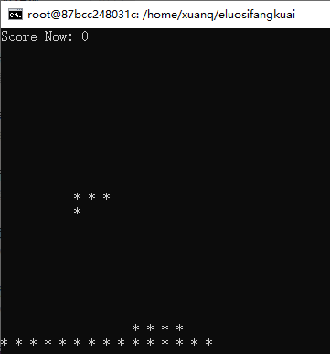

# Tetris-Linux
Implementation of Tetris(Linux Version), purely operate in terminal.

Still have some bugs to fix. See "TODO.txt" for more information.

* Download this repo
* compile the project by
```bash
g++ *.cpp -o tetris
```
* run the program
```bash
./tetris
```

Information for Operation:

* key A : move left;

* key D : move right;

* key W : rotate counter-clockwise;

* key S : rotate clockwise;

* key Space : move down;

Good luck for the Game!


